# Autophagy

<p>
  
</p>

<p>
  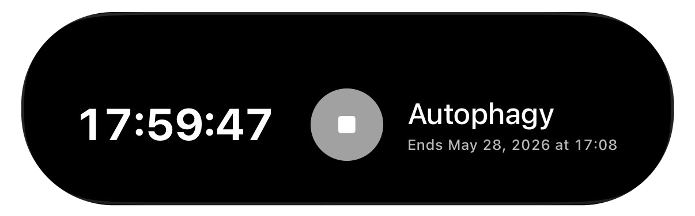
</p>

<p>
  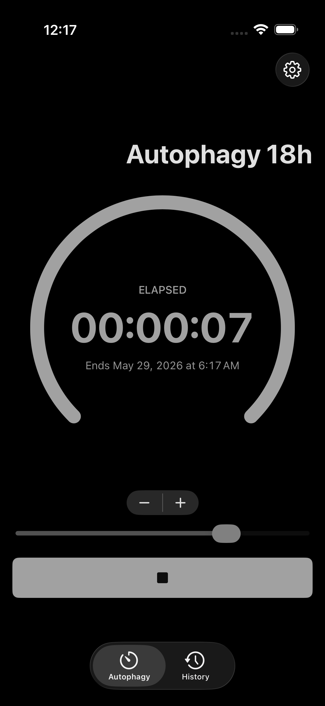
  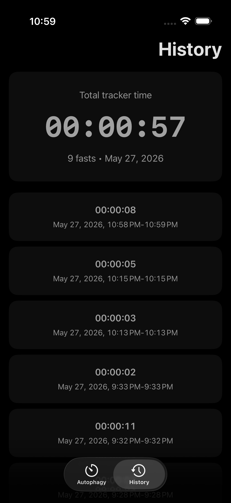
  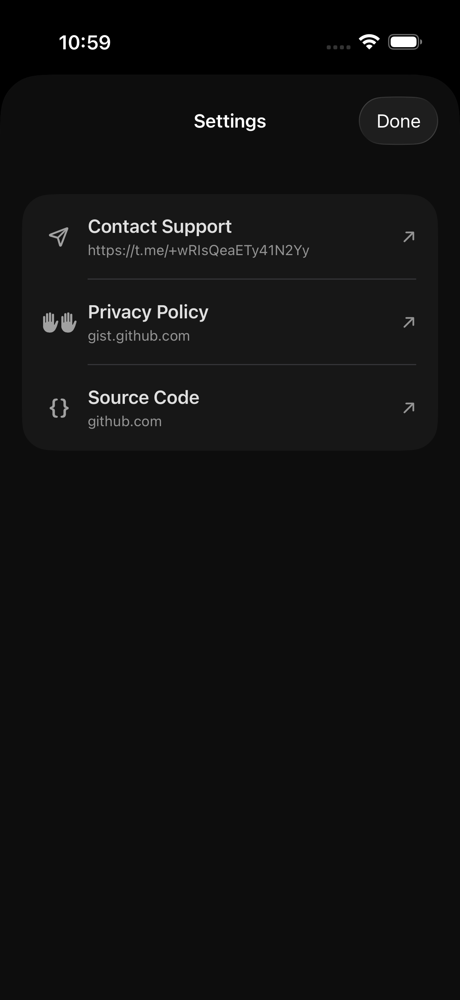
</p>

Autophagy is a native iOS 26.2+ fasting timer app. It lets the user select a fasting duration, start a countdown, keep the session visible through system alarm and Live Activity surfaces, and review completed sessions in history.

## Glossary

- **Fasting session:** A user-tracked fasting interval with `startedAt`, optional `endedAt`, and `plannedDurationSeconds`.
- **Active session:** A fasting session that has started and has no `endedAt` value yet.
- **Completed session:** A fasting session with an `endedAt` value, shown in History.
- **Selected duration:** The user-selected target duration while the tracker is idle.
- **Planned duration:** The countdown duration used for a started fasting session. For selected durations above 23 hours, the app subtracts 2 seconds before scheduling the system countdown.
- **Remaining duration:** The countdown time left until the planned end date.
- **Tracker status:** The current tracker state, either `idle` or `running`.
- **Alarm:** The system countdown scheduled through AlarmKit for the active session.
- **Live Activity:** The lock screen and Dynamic Island surface that displays the active countdown.
- **External stop:** A session completion caused by the tracker alarm disappearing outside the main app flow.
- **Coordinator:** The app-level navigation object that owns tabs, navigation paths, and modal presentation.

## Functional Requirements

- The user can select a fasting duration from 1 to 24 hours while the tracker is idle.
- The app persists the selected fasting duration in user preferences.
- When starting a session with a selected duration above 23 hours, the app subtracts 2 seconds before scheduling the countdown.
- The user can start a fasting session only while the tracker is idle.
- The app checks AlarmKit authorization before starting a fasting session and requests it when needed.
- If AlarmKit authorization is denied, the app does not start the timer and shows a permission alert.
- If alarm scheduling fails, the app keeps the tracker idle and does not create a new active session.
- When alarm scheduling succeeds, the app starts the countdown and creates or reuses an active session.
- The app loads any active session from SwiftData when the tracker view model is initialized and either resumes it or completes it if it already expired.
- The user can stop a running fasting session manually.
- A running fasting session completes automatically when its remaining duration reaches zero.
- A running fasting session completes as an external stop when the tracker alarm no longer exists.
- Completed sessions are persisted in SwiftData and displayed in History.
- The user can delete completed sessions from History.
- The settings screen is presented modally through the app coordinator.

## Technical Requirements

- The app targets iOS 26.2+ and uses the SwiftUI app lifecycle.
- The app uses MVVM + Coordinator for presentation, state, navigation, and modal routing.
- SwiftData stores fasting session data through `AutophagySchemaV1.Session`.
- UserDefaults stores the selected fasting duration through `Preferences`.
- AlarmKit schedules, observes, and cancels the active countdown alarm.
- ActivityKit and WidgetKit render the Live Activity extension.
- AppIntents exposes the Live Activity stop action through `TrackerStopIntent`.
- The app uses dark appearance and localized resources.

## Use Case Diagram

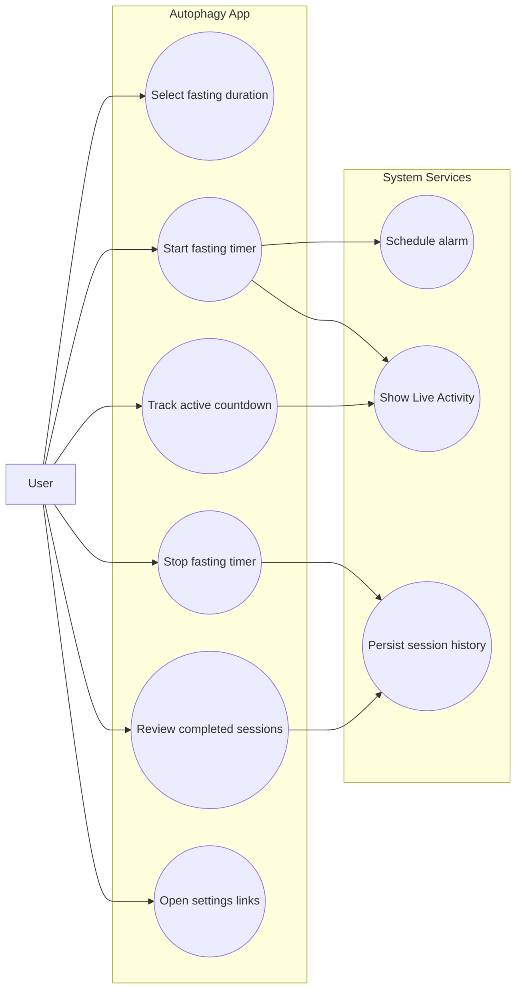

## Activity Diagram

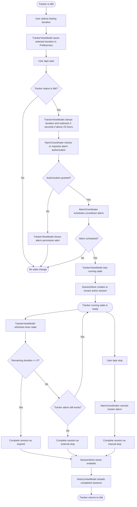

## Tracker State Diagram

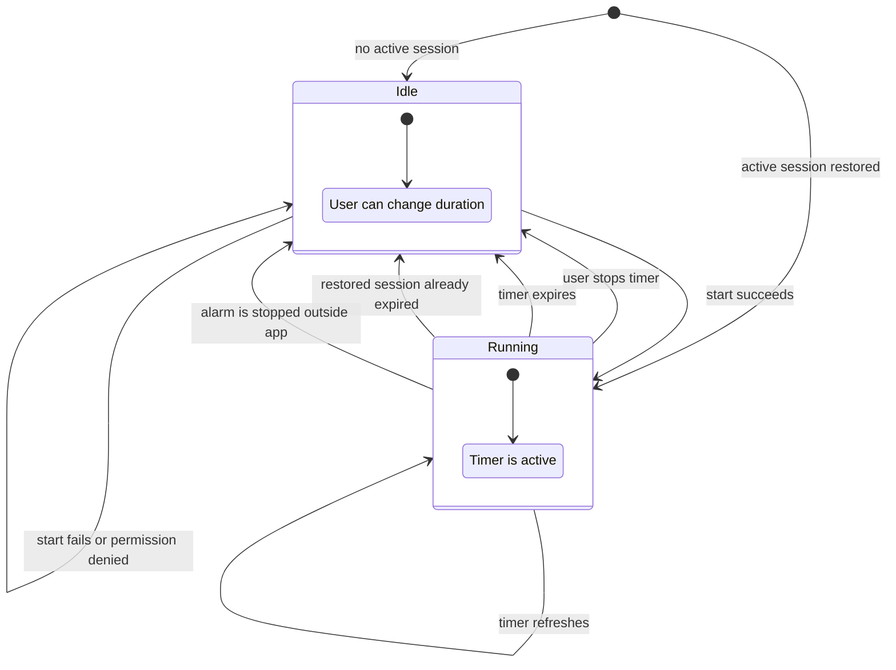

## Start Timer Sequence Diagram

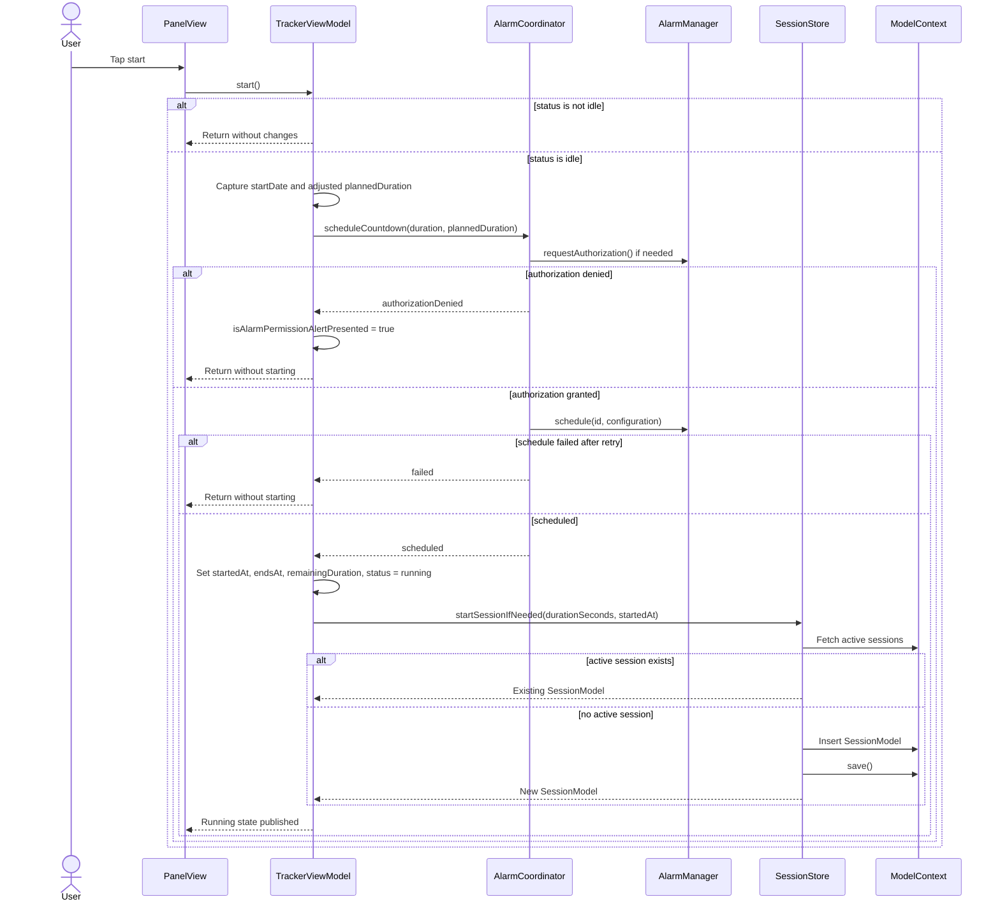

## Data Flow Diagram

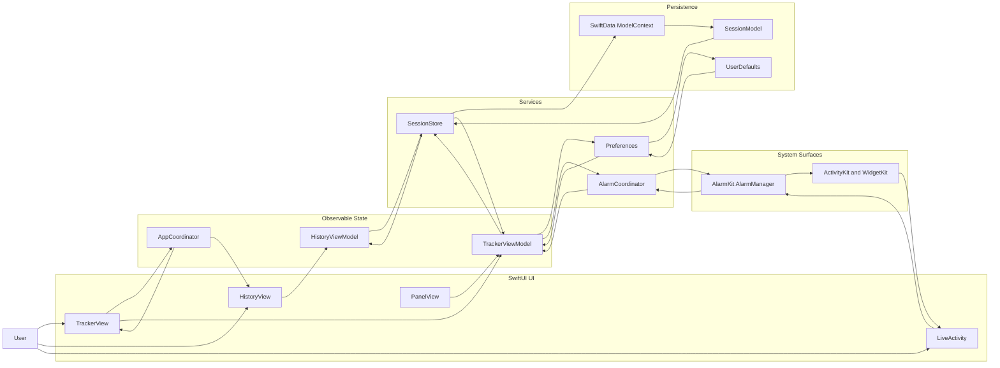

## Architecture

Autophagy uses MVVM + Coordinator. Feature views render SwiftUI state, view models own screen behavior and service coordination, and `AppCoordinator` owns tabs, navigation paths, and modal presentation.

## Class Diagram

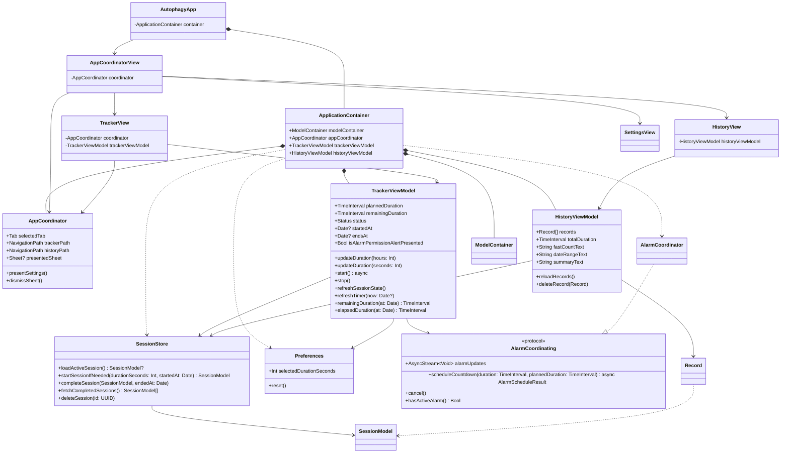

## Component Diagram

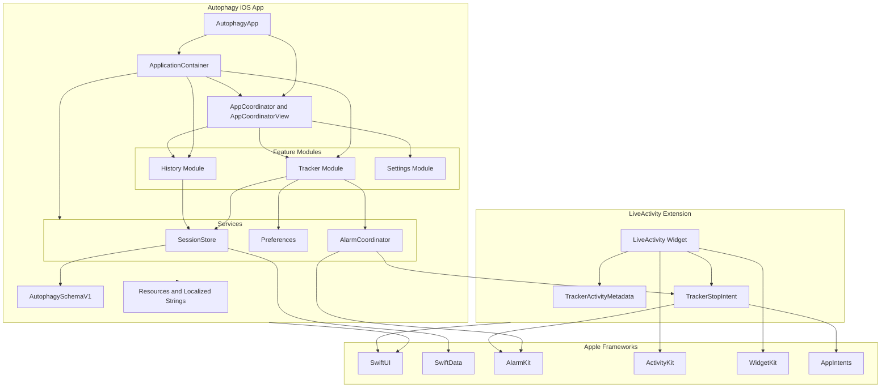

## ERD

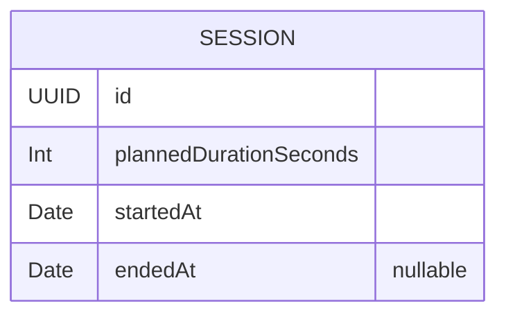

## Project Structure

```text
Autophagy/
  Source/
    iOS/
      Extension/       Shared Swift extensions
      LiveActivity/    Widget extension, ActivityKit layout, AppIntent stop action
      Model/           SwiftData schema and migration plan
      Module/          User-facing features: tracker, history, settings
      Resource/        Assets, strings, constants, colors, fonts, layout values
      Service/
        Alarm/         Alarm scheduling, observation, and protocol contract
        Persistence/   SessionStore over SwiftData
        Preferences/   Preferences over UserDefaults
      AppCoordinator.swift
      AppCoordinatorView.swift
      ApplicationContainer.swift
      AutophagyApp.swift
    Test/              Swift Testing unit tests
  Frameworks/          Referenced Apple framework headers
  Products/            Built app, extension, and test products
```

## Main Modules

- **Tracker:** duration selection, countdown state, start/stop actions, timer refresh, and alarm scheduling.
- **History:** completed fasting sessions loaded from SwiftData and displayed as records.
- **Live Activity:** lock screen and Dynamic Island presentation for the active timer, including a stop intent.
- **Settings:** links to source code, support, and privacy policy.
